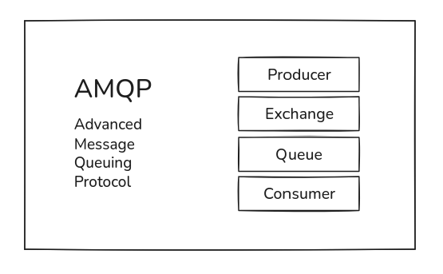
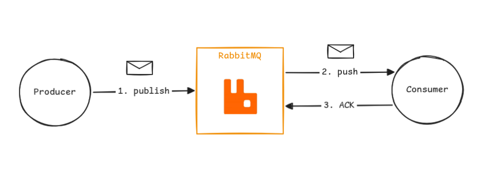
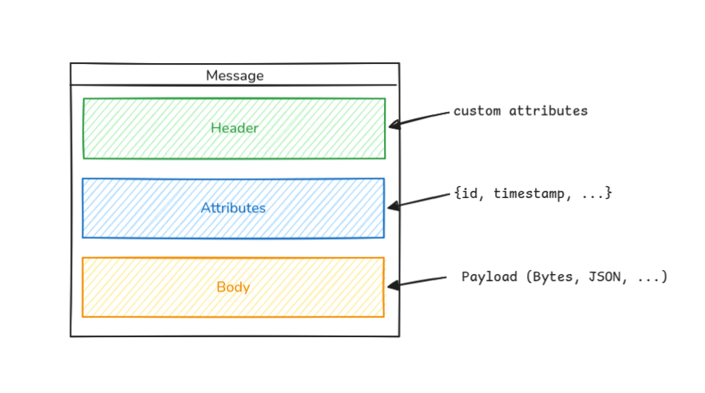

# Spring AMQP Sandbox

This project is a sandbox for experimenting with Spring AMQP, which is a framework for working with Message Broker (RabbitMQ) in Java. It includes examples of how to send and receive messages using RabbitMQ, as well as how to configure the connection and exchange.

## Stack

- Java 21
- Spring Framework
  - Spring Boot
  - Spring Validation
  - Spring Data JPA
  - Spring AMQP (RabbitMQ)
  - Lombok
- Cloud AMQP (Platform to manage RabbitMQ instances)
- Docker & Docker Compose

## Microservices
- **Auth**  
    Microservice to handle simple user credentials registration.
- **Users**  
    Microservice to manage users profiles.

## How does it work?

### AMQP

AMQP means **Advanced Message Queuing Protocol**. It's the protocol behind RabbitMQ and all it architecture. 

### RabbitMQ communication

The RabbitMQ works with **push** communication. The RabbitMQ push new messages to Spring, that receive, handle its, and return the confirmation (**ACK)** that its already consumes the message.

### AMQP message

The AMQP message have three parts:
- **Header**  
    Custom attributes.
- **Attributes**  
    Message metadata.
- **Body**  
    The payload.

